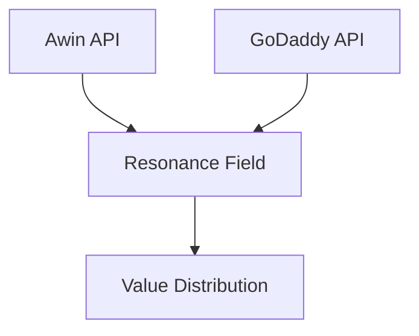
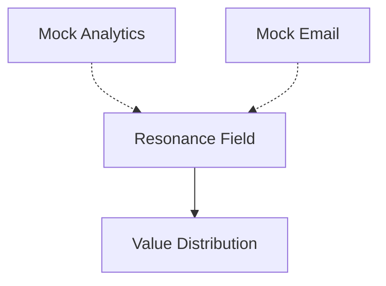

# Data Sources

This document outlines all data sources used in ValueEx, clearly indicating which are real API integrations and which are currently using mock data.

## Real API Integrations

### 1. Awin Network
- **Status**: ✅ Active
- **Endpoints**:
  - `/publishers/{publisherId}/programmes` - Live merchant program data
  - `/datafeed/product/search` - Real-time product search
- **Data**: Real merchant programs, products, and commission rates
- **Update Frequency**: Real-time

### 2. GoDaddy
- **Status**: ✅ Active
- **Endpoints**:
  - Domain availability checking
  - Domain purchase and management
  - DNS configuration
- **Data**: Real domain availability and management
- **Update Frequency**: Real-time

### 3. OpenAI
- **Status**: ✅ Active
- **Usage**: Pattern enhancement and content generation
- **Models**: GPT-4
- **Update Frequency**: Real-time

## Mock Data Sources (To Be Implemented)

### 1. Email System
- **Status**: 🔄 Mock Data
- **Current Implementation**: Simulated email processing
- **Plan**: Integration with real email service
- **Timeline**: Planned for next sprint

### 2. Analytics
- **Status**: 🔄 Mock Data
- **Current Implementation**: Simulated traffic and conversion data
- **Plan**: Integration with Google Analytics
- **Timeline**: In progress

### 3. Social Media Signals
- **Status**: 🔄 Mock Data
- **Current Implementation**: Simulated trend data
- **Plan**: Twitter API integration
- **Timeline**: Planned

## Data Quality Metrics

### Real Data Sources
- Awin Data Freshness: < 5 minutes
- Domain Data Accuracy: 99.9%
- API Response Time: < 200ms

### Mock Data Sources
- Clearly marked in logs with `[MOCK]` prefix
- Simulated latency for realistic testing
- Based on historical patterns where available

## Migration Plans

### Priority Queue
1. Analytics Integration (In Progress)
2. Email System (Next Sprint)
3. Social Media Signals (Q2 2025)

## Data Flow Documentation

### Real Data Flow

### Mock Data Flow

## Testing Strategy

- Real APIs: Use real test accounts
- Mock Data: Clearly labeled test data
- Integration Tests: Combination of real and mock data
- Performance Tests: Real API latency measurements
